Bandersnatch Interactive Player (Based on Browser)


With this online(html) video player you can watch `Bandersnatch` episode of `Black Mirror` **interactively**.

[**English Live demo**](https://ylxb2016.github.io/Bandersnatch/index.en.html)

[**中文版**](https://github.com/ylxb2016/Bandersnatch/)

[**中文在线演示版**](https://ylxb2016.github.io/Bandersnatch/)

---
Table of Contents


- [1. Usage](#1-usage)
  - [1.1. Playback online](#11-playback-online)
  - [1.2. Playback offline](#12-playback-offline)
- [2. Keyboard controls](#2-keyboard-controls)
- [3. Screenshot](#3-screenshot)
- [4. Tips](#4-tips)
  - [4.1. Codec/Container Compatibility](#41-codeccontainer-compatibility)
  - [4.2. Security Restrictions](#42-security-restrictions)
    - [4.2.1. Chromium based Browser](#421-chromium-based-browser)
      - [4.2.1.1. Start by CMD](#4211-start-by-cmd)
      - [4.2.1.2. Start by Shortcut](#4212-start-by-shortcut)
    - [4.2.2. Firefox](#422-firefox)
      - [4.2.2.1. Procedure](#4221-procedure)
    - [4.2.3. Local host](#423-local-host)
  - [4.3. Addition](#43-addition)
- [5. Subtitles](#5-subtitles)
  - [5.1. Multiple Retail Subtitles](#51-multiple-retail-subtitles)
  - [5.2. Toggle subtitles](#52-toggle-subtitles)
    - [5.2.1. Some Screenshots](#521-some-screenshots)
- [6. Reference](#6-reference)
  
---

## 1. Usage

### 1.1. Playback online 
  

The only thing you need is `5:12:40` video file of `Bandersnatch` episode, Drag & drop the file in [English Live demo](https://ylxb2016.github.io/Bandersnatch/) page and enjoy!

### 1.2. Playback offline

1. Close all the browser tabs
2. Open the `autoplay.bat`
3. Choose your Browser and enjoy!


## 2. Keyboard controls

- <kbd>F</kbd> / <kbd>F11</kbd> / <kbd>Double Click</kbd> - Toggle fullscreen
- <kbd>Space</kbd> / <kbd>Mouse Click</kbd>- Toggle play and pause
- <kbd>→</kbd> / <kbd>←</kbd> - Jump to the next / previous segment (or interaction zone)
- <kbd>↑</kbd> / <kbd>↓</kbd> - Speed up / slow down playback
- <kbd>R</kbd> - Restart video
- <kbd>F5</kbd> - Refresh the page
- <kbd>Crtl</kbd>+<kbd>Scroll Wheel</kbd> - Increase/Decrease font size
- <kbd>Ctrl</kbd> +<kbd>0</kbd> - reset font size

Tips：
- Tested at Chrome，Egde，Firefox.  
- If you has not chose a branch within the time limit, it will play automatically the default branch with a `[]` tag, such as `[VISIT DR HAYNES]`.
- You can change the subtitles or playback speed after enabling "Show controls", but do NOT use the "full screen" button in the video player if you enable "Show controls".
- When you encounter playback issues, you can exit the the full screen mode and enter the full screen again, or double-click the screen.


## 3. Screenshot

- Overview
  
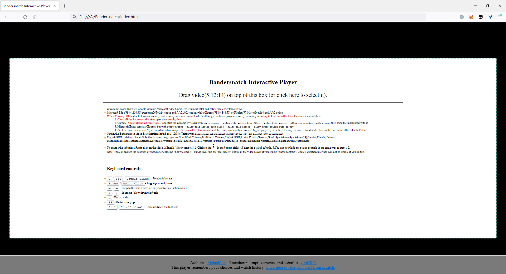

- full screen mode

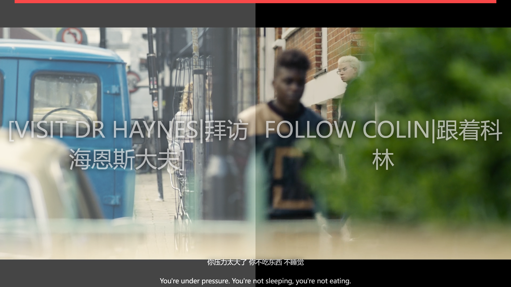

- non full screen mode
  
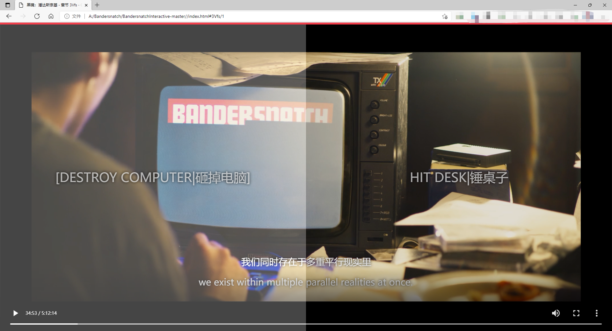

## 4. Tips

Obtain the Bandersnatch video file (duration should be 5:12:40).

Tested with `Black.Mirror.Bandersnatch.2018.1080p.NF.WEB-DL.x264.AAC-PTerWEB.mp4` at `Chrome(99.0.4844.51)`，`Microsoft Edge(99.0.1150.30)`，`Firefox(97.0.2)`，`Opera(74.0.3911.75)`，`SogouExplorer(11.0.1.34700)`.

Chromium based Browser(Google Chrome,**Microsoft Edge(Recommend!)**,Opera,SogouExplorer etc.) support MP4 and MKV, while Firefox only MP4.

### 4.1. Codec/Container Compatibility


|      Browser      | Video Codec | Audio Codec | Container |
| :---------------: | :---------: | :---------: | :-------: |
|  Microsoft Edge   | x264 + x265 |  AAC + AC3  | MP4 + MKV |
| Chrome and others |    x264     |     AAC     | MP4 + MKV |
|      Firefox      |    x264     |     AAC     |    MP4    |


### 4.2. Security Restrictions


Any modern browser with good html5 compatibility can play normally by `index.html`, but due to browser security restrictions, browsers cannot accesse local data files through the file:// protocol by default when playing offline, resulting in failing to load subtitles files. Here are 2 methods:

- To *skip the browser's file:// protocol security restrictions* by **advanced settings** 
- Hosting it to local web mode like [**Live demo**](https://ylxb2016.github.io/Bandersnatch/). You can use portable program like `Quick ‘n Easy Web Server`, or more professional but complicated programs: Nginx/Apache.


PS: Only tested at Windows10. Please search the relevant advanced settings if you use Linux/MacOS.


#### 4.2.1. Chromium based Browser


You can start Chromium based Browser with parameter
`--allow-file-access-from-files --allow-file-access --allow-cross-origin-auth-prompt` to skip the browser's file:// protocol security restrictions. But it will fails if you have not close all the tabs. After starting Browser with the parameter, you can play normally by `index.html`

##### 4.2.1.1. Start by CMD
Chrome: 
```
start chrome --allow-file-access-from-files --allow-file-access --allow-cross-origin-auth-prompt
```  
Edge: 
```
start msedge --allow-file-access-from-files --allow-file-access --allow-cross-origin-auth-prompt
```  
Opera: 
```
start opera --allow-file-access-from-files --allow-file-access --allow-cross-origin-auth-prompt
```  

SogouExplorer：
```
"C:\Program Files (x86)\SogouExplorer\SogouExplorer.exe"  --allow-file-access-from-files --allow-file-access --allow-cross-origin-auth-prompt
```
##### 4.2.1.2. Start by Shortcut

Add the following commands to the Target field in Chrome shortcut properties
```
--allow-file-access-from-files --allow-file-access --allow-cross-origin-auth-prompt
``` 

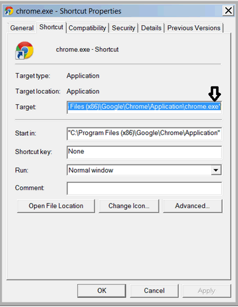


#### 4.2.2. Firefox

Enter `about:config` in the address bar to open `Advanced Preferences`, and accept the risks,then search `privacy.file_unique_origin` in the list using the search bar,double click on the line to pass the value to `False`.

##### 4.2.2.1. Procedure
- open `Advanced Preferences`
```
start Firefox -new-tab about:config
```

- accept the risks

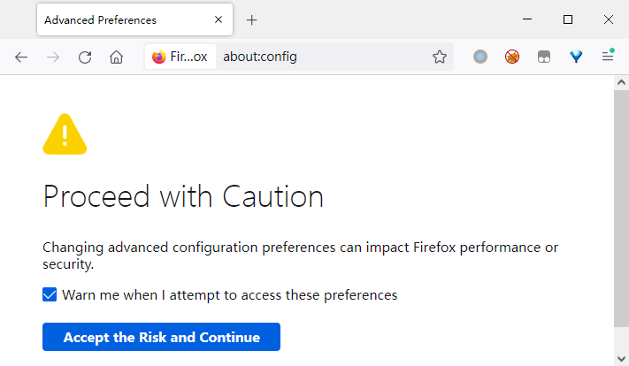

- search `privacy.file_unique_origin`


- set the value to `False`


- If you have playback issues with Firefox, try to check the Permission settings:

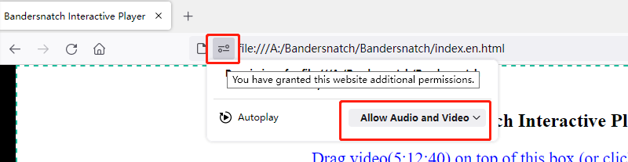

#### 4.2.3. Local host

Local hosting with `Quick ‘n Easy Web Server`

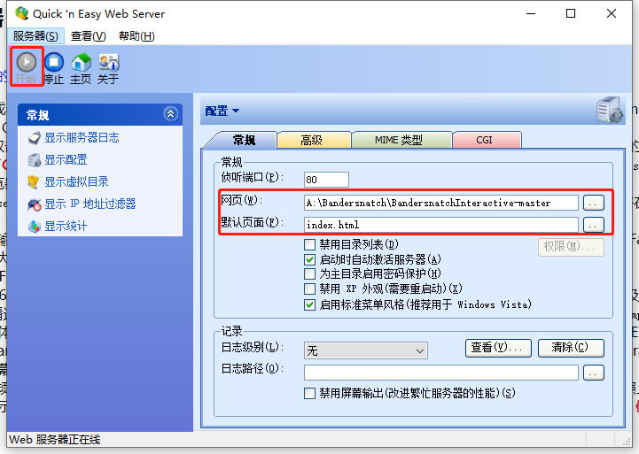


Enter `http://localhost/` or `http://127.0.0.1` in the address bar to open the player

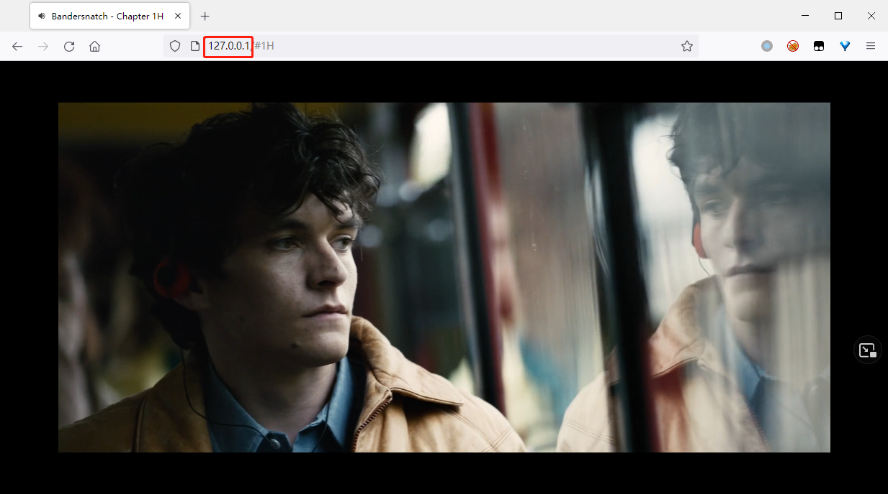


### 4.3. Addition

- The part of scenes may be partially missing, for instance:  numbers won't show up during the phone dialing scene. The player cannot 100% reproduce the effects as Netflix.
- index.html is adjusted in the 1080p environment, maybe some unpredictable dislocations may occur in other resolutions.

## 5. Subtitles

### 5.1. Multiple Retail Subtitles

**English SDH** is default. Retail Subtitles in many languages are Simplified Chinese,Traditional Chinese,English SDH,Arabic,Danish,German,Greek,Spanish(es),Spanish(es-ES),Finnish,French,Hebrew, Indonesian,Icelandic,Italian,Japanese,Korean,Norwegian (Bokmål),Dutch,Polish,Portuguese (Portugal),Portuguese (Brazil),Romanian,Russian,Swedish,Thai,Turkish,Vietnamese.

All the subs come from NF stream, thanks AERY!


For convenience, 2 sets `Simplified Chinese`,`Traditional Chinese` and `English SDH` were added to the subs menu. The top subs dispaly in the scenes, while the bottom subs dispaly in the letterbox. You can notice the difference in the screenshots below. Choose one according to your hobbies.

The subtitles file in the sub-folder named **Forced** are all Forced subtitles for various languages, which are not used here.


More suitable subtitles(vtt format) are welcome!
  
### 5.2. Toggle subtitles

1. Right click on the video. 
2. Enable "Show controls".
3. Click on the menu item in the bottom-right.
4. Select the desired subtitle.
5. You can now hide the player controls in the same way as step 1-2.

#### 5.2.1. Some Screenshots

Mircosoft Edge: Show all controls

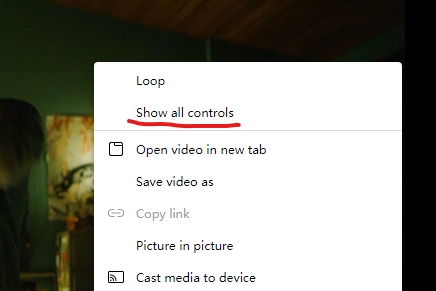

Firefox: Show controls

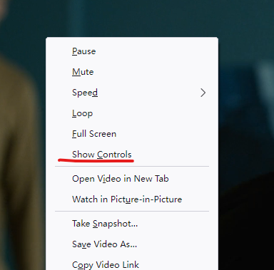

menu item in the bottom-right

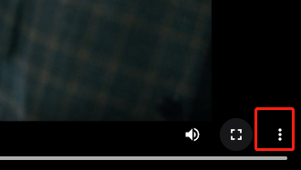

menu in Edge

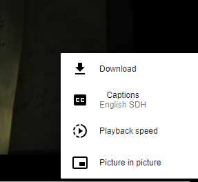

Subtitles Menu

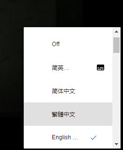

subs dispaly in the scenes

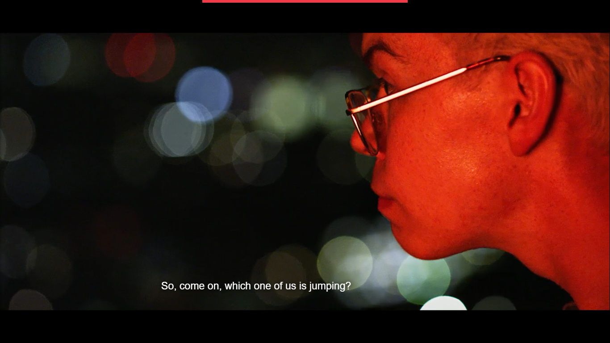

subs dispaly in the letterbox


## 6. Reference

- [Original Author](https://github.com/joric/bandersnatch)
- [Enhanced Version Author](https://github.com/mehotkhan/BandersnatchInteractive)
- https://engelsjk.com/posts/through-the-looking-glass-at-netflix/
- https://en.wikipedia.org/wiki/HTML5_audio
- https://en.wikipedia.org/wiki/HTML5_video
- https://bugs.chromium.org/p/chromium/issues/detail?id=243861
- https://support.mozilla.org/en-US/kb/html5-audio-and-video-Firefox
