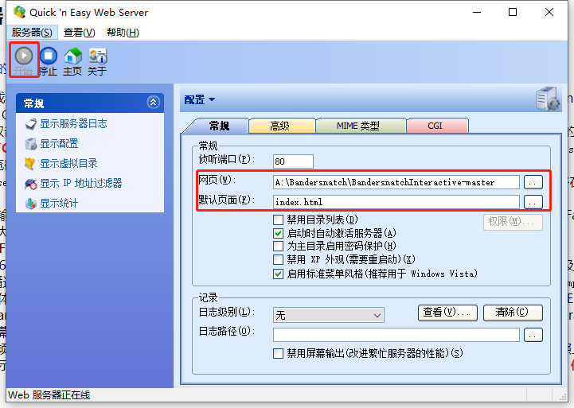
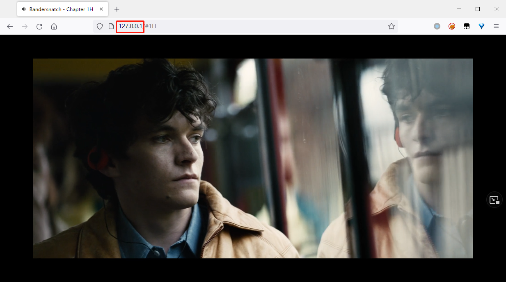

黑镜：潘达斯奈基 互动播放器 (基于浏览器)


通过本html播放器，可实现电影`《黑镜：潘达斯奈基》`的交互式体验。

[**中文在线演示版**](https://ylxb2016.github.io/Bandersnatch/)

[**English Version**](https://github.com/ylxb2016/Bandersnatch/blob/main/README.en.md)

[**English Live demo**](https://ylxb2016.github.io/Bandersnatch/index.en.html)


---
目录


- [1. 用法](#1-用法)
  - [1.1. 在线观看](#11-在线观看)
  - [1.2. 离线观看](#12-离线观看)
- [2. 操作](#2-操作)
- [3. 效果截图](#3-效果截图)
- [4. 说明](#4-说明)
  - [4.1. 编码及容器格式支持](#41-编码及容器格式支持)
  - [4.2. 绕过浏览器安全限制](#42-绕过浏览器安全限制)
    - [4.2.1. Chrome等的设置](#421-chrome等的设置)
      - [4.2.1.1. 命令行启动](#4211-命令行启动)
      - [4.2.1.2. 快捷方式启动](#4212-快捷方式启动)
    - [4.2.2. Firefox的设置](#422-firefox的设置)
      - [4.2.2.1. 截图参考](#4221-截图参考)
    - [4.2.3. 本地WEB搭建](#423-本地web搭建)
  - [4.3. 文件解读](#43-文件解读)
  - [4.4. 其他说明](#44-其他说明)
- [5. 字幕](#5-字幕)
  - [5.1. 多国字幕](#51-多国字幕)
  - [5.2. 字幕切换](#52-字幕切换)
    - [5.2.1. 截图参考](#521-截图参考)
- [6. 参考](#6-参考)
  
---

## 1. 用法

### 1.1. 在线观看  
  

只需将 **时长5:12:40** 的`《黑镜：潘达斯奈基》`视频文件拖放到该[演示页面](https://ylxb2016.github.io/Bandersnatch/)即可开始播放。

### 1.2. 离线观看

1. 关闭所有浏览器窗口
2. 运行`自动播放.bat`
3. 选择对应的浏览器即可


## 2. 操作

- <kbd>F</kbd> / <kbd>F11</kbd> / <kbd>鼠标双击</kbd> - 开关全屏模式  
- <kbd>R</kbd> - 从头播放视频  
- <kbd>→</kbd> / <kbd>←</kbd> - 跳到下一个/上一个 剧情支线(或互动选择界面)  
- <kbd>↑</kbd> / <kbd>↓</kbd> - 加速播放/减速播放  
- <kbd>空格</kbd> / <kbd>鼠标单击</kbd> - 切换播放/暂停  
- <kbd>F5</kbd> - 刷新页面，回到初始化位置  
- <kbd>Crtl</kbd>+<kbd>鼠标滚轮</kbd> - 调节字体大小
- <kbd>Ctrl</kbd> +<kbd>0</kbd> - 恢复默认字体大小

注：
- 以上操作在Chrome，Egde，Firefox浏览器内测试通过，其他浏览器可能会有一定的偏差。  
- 选择剧情时，如果未在限定时间内进行选择，则会按照默认剧情播放。默认选项会被`[]`标记，如`[VISIT DR HAYNES|拜访海恩斯大夫]`。
- 播放器的控制面板可以通过【显示所有控件】打开，可以选择字幕、播放速度等。
- 请勿在全屏播放时*持续*启用【显示所有控件】功能，使用完成后立即关闭！！！ 否则可能遇到播放问题。
- 遇到播放故障时，可以重新退出并进入全屏或者鼠标双击屏幕试试。


## 3. 效果截图

- 预览
  


- 全屏


- 非全屏
  


## 4. 说明

请自行下载时长为5:12:40的《黑镜：潘达斯奈基》视频文件。 

本播放器经`Black.Mirror.Bandersnatch.2018.1080p.NF.WEB-DL.x264.AAC-PTerWEB.mp4` 在`Chrome 99.0.4844.51`，`微软Edge浏览器 99.0.1150.30`，`Firefox 97.0.2`，`Opera_74.0.3911.75`，`搜狗浏览器11.0.1.34700`等浏览器测试通过。

Google Chrome，**Microsoft Edge【强烈推荐】**，Opera，搜狗浏览器等Chromium内核的浏览器支持mp4及mkv格式的视频文件；Firefox火狐浏览器不支持mkv格式，可支持mp4格式。

### 4.1. 编码及容器格式支持


|     浏览器     |  视频编码   | 音频编码  | 容器(后缀) |
| :------------: | :---------: | :-------: | :--------: |
| Microsoft Edge | x264 + x265 | AAC + AC3 | MP4 + MKV  |
|    Chrome等    |    x264     |    AAC    | MP4 + MKV  |
|    Firefox     |    x264     |    AAC    |    MP4     |


### 4.2. 绕过浏览器安全限制

原则上，任何拥有良好html5支持的现代浏览器均可通过`index.html`进行播放，但受浏览器的安全限制，Chrome等浏览器默认不可以通过file协议加载文件，从而导致离线播放时无法加载字幕文件。故而有两种解决方式：
- 通过**特定的设置**来*规避浏览器的file协议安全限制* 
- 类似于上述[在线演示版](https://ylxb2016.github.io/Bandersnatch/)，将本项目托管为在线http模式，可使用`Quick ‘n Easy Web Server`这类小程序，当然了你也可以使用Nginx或者Apache等大部头。

注：仅在Windows10下进行了测试，Linux及MacOS原则上也可以，请自行搜索相关设置。


#### 4.2.1. Chrome等的设置

Chrome等浏览器可以通过启动时加参数`--allow-file-access-from-files --allow-file-access --allow-cross-origin-auth-prompt` 实现对此安全限制的规避，但如果原浏览器窗口未关闭，那么该参数将可能会无效，因此使用该方式启动前请先关闭所有相同浏览器的窗口。通过这种方式打开的浏览器后，便可以载入index.html进行播放。

##### 4.2.1.1. 命令行启动
Chrome: 
```
start chrome --allow-file-access-from-files --allow-file-access --allow-cross-origin-auth-prompt
```  
Edge: 
```
start msedge --allow-file-access-from-files --allow-file-access --allow-cross-origin-auth-prompt
```  
Opera: 
```
start opera --allow-file-access-from-files --allow-file-access --allow-cross-origin-auth-prompt
```  

搜狗浏览器：
```
"C:\Program Files (x86)\SogouExplorer\SogouExplorer.exe"  --allow-file-access-from-files --allow-file-access --allow-cross-origin-auth-prompt
```
##### 4.2.1.2. 快捷方式启动

命令行方式虽然直观，但每次关闭后变会失效，每次打开均需输入长短命令颇为繁琐；如若准备长期绕过浏览器安全限制，则建议修改浏览器快捷方式（图标）的属性设置。将`--allow-file-access-from-files --allow-file-access --allow-cross-origin-auth-prompt` 增加到快捷方式属性的【目标】后，如下图所示：


#### 4.2.2. Firefox的设置

不同于Chrome系的浏览器，Firefox浏览器需要在地址栏输入`about:config`来打开高级设置，然后搜索`privacy.file_unique_origin`点击添加，再双击选项，将设置从True调整为False，然后刷新网页即可。

##### 4.2.2.1. 截图参考
打开【高级首选项】
```
start Firefox -new-tab about:config
```


搜索`privacy.file_unique_origin`点击添加


双击选项，将设置从True调整为False


如果Firefox无法正常播放，请检查浏览器的权限设置


#### 4.2.3. 本地WEB搭建

使用`Quick ‘n Easy Web Server`搭建本地WEB



在浏览器中输入`http://localhost/` 或者`http://127.0.0.1` 打开播放器




### 4.3. 文件解读

- assets 包含控制用的js脚本。其中bandersnatch.js包含剧情选择的时间点(单位为毫秒)及提示语。bandersnatch_en.js为原版英文，bandersnatch.js为本人自行翻译，不足之处还请指正！
- screenshot 包含各截图。
- subtitle 包含各字幕。
- video 用来存放视频文件。
- **index.html** 核心文件，用来播放视频。
- autoplay.bat & **自动播放.bat** 用来快捷启动浏览器
- README.md & README.EN.md 说明文件

### 4.4. 其他说明

- 若想实现特效字幕之类的效果，需要将字幕以硬字幕的方式进行压制。
- 支线剧情选择可能有部分缺失，如拨号界面，无法百分百复刻NF官方效果。
- index.html在1080p环境下调整，其他分辨率下可能会出现一些不可预料的错位等情况。

## 5. 字幕

### 5.1. 多国字幕  

默认简英双语字幕，支持简英双语，简体中文，繁體中文，English SDH，Arabic，Danish，German，Greek，Spanish(es)，Spanish(es-ES)，Finnish，French，Hebrew，Indonesian，Icelandic，Italian，Japanese，Korean，Norwegian (Bokmål)，Dutch，Polish，Portuguese (Portugal)，Portuguese (Brazil)，Romanian，Russian，Swedish，Thai，Turkish，Vietnamese等多国字幕。

简英双语字幕由Arayn合并官方字幕手工调整得到，剩下字幕均为NF官方字幕，感谢锐大提供的素材！

为便于操作，字幕菜单里顶部和底部均加了`简英双字`，`简体中文`，`繁体中文`，`英文SDH`。但顶部的`简体中文`，`繁体中文`，`英文SDH`会显示在画面内，而底部的`简体中文`，`繁体中文`，`英文SDH`则会显示在黑框内。请根据喜好自行选择。

subtitle内的Forced子文件夹内为各国强制字幕，仅做存档，实际未使用。

欢迎提交更精良的字幕（vtt格式）。
  
### 5.2. 字幕切换

1. 播放视频后，在视频内鼠标右键打开菜单. 
2. 启用【显示所有控件】 
3. 鼠标单击页面右下角的菜单
4. 选择对应的字幕 
5. 然后按照上边步骤1-2关闭【显示所有控件】

#### 5.2.1. 截图参考
Chrome等显示所有控件


Firefox显示所有控件


页面右下角菜单位置


菜单


字幕菜单


字幕在画面内


字幕在黑边内


## 6. 参考

- https://github.com/joric/bandersnatch
- https://github.com/mehotkhan/BandersnatchInteractive
- https://engelsjk.com/posts/through-the-looking-glass-at-netflix/
- https://en.wikipedia.org/wiki/HTML5_audio
- https://en.wikipedia.org/wiki/HTML5_video
- https://bugs.chromium.org/p/chromium/issues/detail?id=243861
- https://support.mozilla.org/en-US/kb/html5-audio-and-video-Firefox
